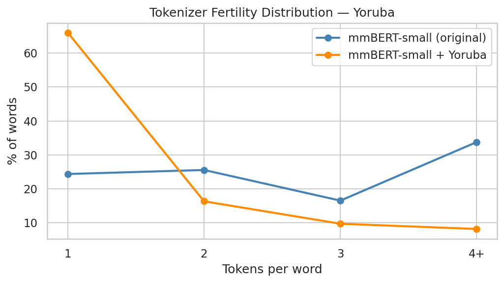
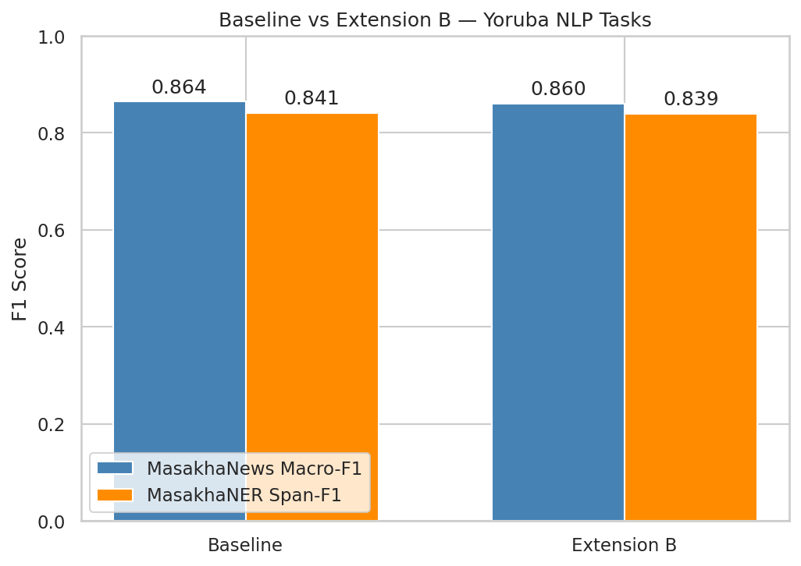
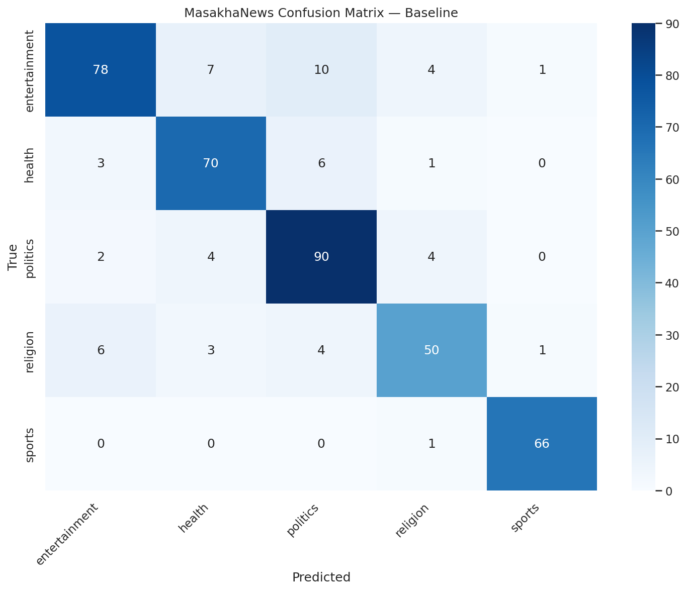
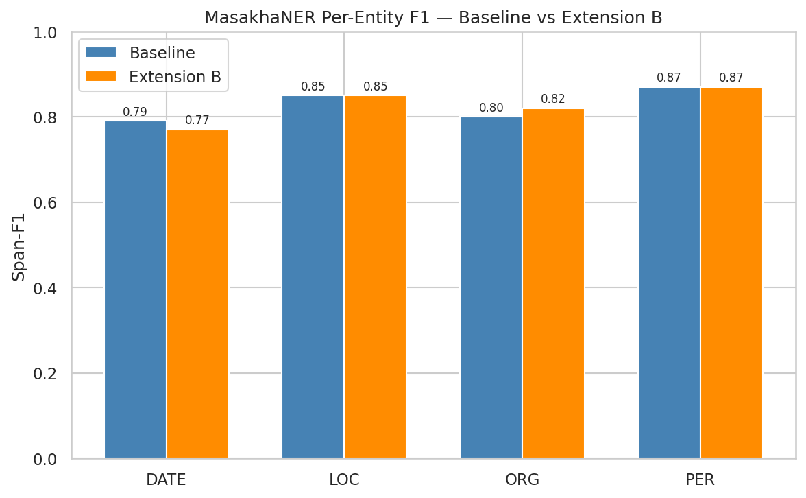

# CSC5035Z Assignment 2: Fine-Tuning Language Models on African Language NLP Tasks

**Course:** CSC5035Z Natural Language Processing, UCT 2026  
**Student:** Praise Jaravani — JRVPRA001  
**Language:** Yoruba (`yor`)

---

## 1. Language Description and NLP Challenges

Yoruba is a tonal Niger-Congo language spoken by approximately 50 million people across
Nigeria, Benin, and Togo, making it one of the most widely spoken African languages.
Despite its speaker population, Yoruba remains severely under-resourced in NLP: most
large pre-trained language models have seen little Yoruba text during pre-training, and
those that have often treat its complex orthography poorly.

The central orthographic challenge is the use of **diacritical marks** to encode tonal
and vowel quality distinctions. Yoruba uses three tones (high, mid, low) written as
acute, no mark, and grave accents respectively, combined with under-dotted vowels (ẹ, ọ)
to indicate open vowel quality. A single word can carry multiple stacked diacritics
(e.g., *ẹ̀kọ́*, *ọjọ́*), and the meaning changes completely if the wrong mark is used
or omitted. For standard multilingual tokenizers trained predominantly on European and
East Asian text, these stacked Unicode characters are split into their base letter and
combining diacritic code points as separate tokens — resulting in extremely high
token-per-word ratios that waste sequence budget and dilute contextual representations.

---

## 2. Tasks, Datasets, and Evaluation Metrics

### 2.1 Text Classification — MasakhaNews

**Dataset:** MasakhaNEWS (Adelani et al., 2023) [`masakhane/masakhanews`, config `yor`].
A news topic classification benchmark covering African languages. The Yoruba subset
contains 1,433 training, 206 validation, and 411 test examples across **5 categories:**
entertainment, health, politics, religion, and sports. Input is the article headline.

**Metric:** Macro-F1, which averages per-class F1 scores with equal weight per class,
appropriate for moderately imbalanced multi-class classification.

### 2.2 Token Classification — MasakhaNER 2.0

**Dataset:** MasakhaNER 2.0 (Adelani et al., 2022) [`masakhane/masakhaner2`, config `yor`].
A named entity recognition benchmark for African languages. The Yoruba subset contains
6,876 training, 983 validation, and 1,964 test sentences annotated in BIO format with
**four entity types:** PER (person), ORG (organisation), LOC (location), DATE.

**Metric:** Span-level F1 computed by seqeval, which requires exact span boundaries to
match — partial credit is not given. This is stricter than token-level accuracy and is
the standard metric for NER evaluation.

---

## 3. Data Preprocessing

**Text classification:** Headlines were tokenized using the mmBERT-small tokenizer with
`truncation=True`, `max_length=128`, and `padding='max_length'`. No further
preprocessing was applied; the raw headline text was used directly.

**Token classification:** Sentences were tokenized with `is_split_into_words=True` since
the dataset provides pre-tokenized word sequences. Subword-to-word label alignment was
performed as follows: the first subword of each word receives the word's NER label;
all continuation subwords and special tokens ([CLS], [SEP], padding) receive label
`-100`, which is masked from the cross-entropy loss computation. This is critical
for correct training — assigning labels to continuation subwords would cause the model
to learn inconsistent label boundaries.

**Reproducibility:** All runs used seed 42 applied to Python, NumPy, and PyTorch
(`torch.backends.cudnn.deterministic = True`).

---

## 4. Baseline Approach

The baseline fine-tunes `jhu-clsp/mmBERT-small` — a compact multilingual BERT-style
encoder (ModernBERT architecture, 256k vocabulary) — independently on each task by
adding a task-specific linear classification head:

- **Text classification:** Linear head over the [CLS] token representation.
- **Token classification:** Linear head applied to every token representation.

Both tasks use cross-entropy loss, AdamW optimiser, and a linear warmup scheduler.
Training used the official train/validation/test splits; the test set was never used
for model selection. The best checkpoint (by validation F1) was saved and reloaded
for final test evaluation.

### 4.1 Hyperparameters

| Hyperparameter | Value |
|---|---|
| Learning rate | 5×10⁻⁵ |
| Batch size | 16 |
| Max epochs | 5 |
| Warmup steps | 100 |
| Weight decay | 0.01 |
| Early stopping patience | 2 epochs |
| Max sequence length | 128 |
| Seed | 42 |

The learning rate was selected from {1×10⁻⁵, 2×10⁻⁵, 3×10⁻⁵, 5×10⁻⁵} by sweeping all
four values on train/validation splits only (test set never seen):

| LR | News val-F1 | NER val-F1 |
|---|---|---|
| 1×10⁻⁵ | 0.7983 | 0.7446 |
| 2×10⁻⁵ | 0.8414 | 0.7791 |
| 3×10⁻⁵ | 0.8293 | 0.8198 |
| **5×10⁻⁵** | **0.8533** | **0.8198** |

5×10⁻⁵ was selected for both tasks. Lower rates showed slower convergence within 5
epochs. The same hyperparameters were reused for Extension B without re-tuning to ensure
a fair comparison.

### 4.2 Baseline Results

| Model | MasakhaNews Macro-F1 | MasakhaNER Span-F1 |
|---|---|---|
| mmBERT-small (Baseline) | **0.8641** | **0.8407** |

**MasakhaNews per-class F1 (baseline):**

| Class | Precision | Recall | F1 | Support |
|---|---|---|---|---|
| entertainment | 0.88 | 0.78 | 0.83 | 100 |
| health | 0.83 | 0.88 | 0.85 | 80 |
| politics | 0.82 | 0.90 | 0.86 | 100 |
| religion | 0.83 | 0.78 | 0.81 | 64 |
| sports | 0.97 | 0.99 | 0.98 | 67 |

**MasakhaNER per-entity F1 (baseline):**

| Entity | Precision | Recall | F1 | Support |
|---|---|---|---|---|
| PER | 0.87 | 0.87 | 0.87 | 743 |
| LOC | 0.84 | 0.87 | 0.85 | 500 |
| ORG | 0.79 | 0.82 | 0.80 | 391 |
| DATE | 0.77 | 0.81 | 0.79 | 297 |

Both baselines are strong given the small training sets. Sports is the easiest news
category (F1=0.98), likely because sports vocabulary is distinctive. Religion improved
markedly over lower-LR runs (F1=0.81), though it remains the hardest class — Yoruba
celebrity stories overlap in vocabulary with religious discourse. DATE is the hardest NER
entity (F1=0.79), reflecting the complexity of Yoruba date expressions.

---

## 5. Extension B: Vocabulary Adaptation

*This section describes work implemented individually by Praise Jaravani — JRVPRA001.*

### 5.1 Motivation

The mmBERT-small tokenizer achieves a mean of **3.12 tokens per word** on Yoruba text,
compared to approximately 1.0–1.5 for well-resourced languages like English. This is
caused by stacked diacritics being split into base characters and combining code points.
For example, *ẹ̀kọ́* (meaning "education") is tokenized into 6 tokens:
`['▁', 'ẹ', '̀', 'k', 'ọ', '́']`. High fertility wastes the 128-token sequence
budget, truncates longer sentences, and forces the model to reconstruct whole-word
meaning from isolated diacritic fragments that carry no semantic information alone.

The hypothesis is that extending the vocabulary with Yoruba-specific tokens will reduce
fertility, allow more text to fit within the sequence budget, and improve downstream
task performance.

### 5.2 Method

**Step 1 — Corpus collection:** The Yoruba train splits from both tasks (8,309 sentences,
198,443 words) were combined into a single corpus for BPE training.

**Step 2 — BPE training:** A BPE tokenizer was trained on the corpus using the HuggingFace
`tokenizers` library with `vocab_size=1000` and `min_frequency=5`. After training, the
BPE vocabulary contained 1,000 entries.

**Step 3 — Token selection:** New tokens were identified by diffing the BPE vocabulary
against the existing mmBERT-small vocabulary (256,000 tokens). Tokens shorter than 2
characters and the `[UNK]` special token were excluded. This yielded **637 new tokens**,
all satisfying the minimum frequency threshold.

**Step 4 — Tokenizer extension:** The 637 new tokens were added to the mmBERT-small
tokenizer using `add_tokens()`. The vocabulary grew from 256,000 to 256,637. The
extended tokenizer was saved to disk.

**Step 5 — Embedding initialisation (principled):** The mmBERT-small encoder was loaded
and its embedding matrix resized with `resize_token_embeddings(256637)`. For each new
token, rather than using random initialisation, we computed a **mean-of-subwords
embedding**: the new token string was tokenized using the *original* (pre-extension)
tokenizer, and the new embedding was set to the mean of the existing embeddings for
those subword pieces. For example, the new token *ọmọ* was decomposed by the original
tokenizer into `['▁ọ', 'm', 'ọ']`, and its initial embedding was set to
`mean(embed('▁ọ'), embed('m'), embed('ọ'))`. All 637 new tokens received mean-based
initialisation (0 random-only fallbacks), as the original tokenizer could decompose
every new token into existing subwords.

This approach is motivated by the goal of placing new tokens in a semantically coherent
region of the embedding space from the start of fine-tuning, rather than requiring the
model to learn their representations from scratch.

### 5.3 Fertility Results

| Tokenizer | Vocab Size | Mean toks/word | Median | 95th pct | % single-token |
|---|---|---|---|---|---|
| mmBERT-small (original) | 256,000 | 3.12 | 3.0 | 7.0 | 24.3% |
| mmBERT-small + Yoruba | 256,637 | **1.66** | **1.0** | **4.0** | **66.1%** |

The mean tokens-per-word dropped by 47%. Most strikingly, 66.1% of words now tokenize
as a single unit (up from 24.3%), meaning the majority of Yoruba vocabulary is now
represented atomically. The qualitative improvement is visible in the diacritic word
probe — *ọmọ* (child) and *ọjọ́* (day) each reduced from 3–4 tokens to a single token.

*Figure 1: Token-per-word distribution before and after vocabulary extension. The shift
from a right-skewed distribution (original) to a near-uniform single-token majority
(extended) confirms the fertility reduction.*

### 5.4 Downstream Results

The extended model was fine-tuned on both tasks using identical hyperparameters to the
baseline.

| Model | MasakhaNews Macro-F1 | MasakhaNER Span-F1 |
|---|---|---|
| mmBERT-small (Baseline) | **0.8641** | **0.8407** |
| mmBERT-small + Vocab Ext (Ext B) | 0.8605 | 0.8393 |
| Delta | −0.0036 | −0.0014 |

At the sweep-selected LR of 5×10⁻⁵, vocabulary extension produces negligible change on
both tasks: −0.36% on news and −0.14% on NER, both well within run-to-run variance
for this dataset size. The large NER regression seen at 2×10⁻⁵ (−1.85%) was therefore
partly an artefact of the suboptimal learning rate rather than a fundamental incompatibility
between vocabulary extension and token classification.

**Per-class analysis — MasakhaNews (Ext B):**

| Class | Precision | Recall | F1 | Support |
|---|---|---|---|---|
| entertainment | 0.83 | 0.85 | 0.84 | 100 |
| health | 0.88 | 0.82 | 0.85 | 80 |
| politics | 0.90 | 0.85 | 0.88 | 100 |
| religion | 0.73 | 0.84 | 0.78 | 64 |
| sports | 0.97 | 0.94 | 0.95 | 67 |

**Per-entity analysis — MasakhaNER (Ext B):**

| Entity | Precision | Recall | F1 | Support |
|---|---|---|---|---|
| PER | 0.88 | 0.87 | 0.87 | 766 |
| LOC | 0.82 | 0.88 | 0.85 | 529 |
| ORG | 0.83 | 0.81 | 0.82 | 402 |
| DATE | 0.75 | 0.79 | 0.77 | 312 |

The entity support counts again increase relative to the baseline (e.g. PER: 743→766,
DATE: 297→312) confirming that lower fertility fits more complete sentences within the
128-token window. Despite evaluating on more entities, Ext B achieves near-identical
span-F1 to the baseline — suggesting that with sufficient LR, the model successfully
re-learns span boundary cues from the new tokenization.

*Figure 2: Test F1 for baseline and Extension B on both tasks. Differences are within
±0.004, indicating vocabulary adaptation has negligible effect at the optimal LR.*

---

## 6. Error Analysis

### 6.1 MasakhaNews

Of the 411 test examples, baseline and Ext B disagree on 45 predictions: **22 cases
where Ext B was right and baseline wrong**, and **23 where baseline was right and Ext B
wrong** — a near-symmetric swap with no net gain for either model.

Ext B fixed cases are predominantly **entertainment headlines misclassified as health,
politics, or sports** by the baseline — specifically stories involving Yoruba celebrity
names and cultural events whose vocabulary fragmentation made them ambiguous to the
baseline tokenizer.

Ext B introduced errors mainly in the **entertainment → religion** direction: Christmas
celebration stories and obituary-style entertainment headlines (e.g., a celebrity
reflecting on their mother's death) were pulled toward religion once culturally loaded
Yoruba words merged into single tokens that the extended model associates with religious
discourse. This explains religion's F1 drop (baseline 0.81 → Ext B 0.78). Politics
shows the largest Ext B improvement (F1: 0.86→0.88), suggesting Yoruba political
vocabulary benefits most from atomic representation.

*Figure 3: Confusion matrix for the baseline on the MasakhaNews test set. The
entertainment/religion confusion is the dominant off-diagonal pattern.*

### 6.2 MasakhaNER

Of 1,964 test sentences, **287 (14.6%)** contained at least one entity prediction error
in the baseline (down from 297 at the suboptimal 2×10⁻⁵ LR).

The dominant error pattern is **ORG span fragmentation**: the model correctly identifies
the start of a multi-word organisation name (`B-ORG`) but drops the continuation tokens,
then predicts `B-LOC` for the final word of the organisation span. This pattern appears
in 3 of the 5 most common error sentences and reflects two compounding difficulties:
(1) Yoruba organisation names are often long compounds with internal diacritics that
are hard to segment, and (2) location-like words frequently appear at the end of
institutional names.

A secondary error type is **spurious PER predictions**: the model predicts `B-PER` for
words that are not entities, typically at sentence-initial positions where capitalised
Yoruba words can resemble proper nouns. DATE remains the hardest entity type (F1: 0.79
baseline, 0.77 Ext B), reflecting the complexity of Yoruba temporal expressions.

*Figure 4: Per-entity span-F1 for baseline and Extension B. PER and LOC are most
accurate in both models; DATE is consistently the hardest entity type.*

---

## 7. Conclusion

Fine-tuning mmBERT-small on Yoruba achieves strong results on both tasks (news: 0.8641
macro-F1, NER: 0.8407 span-F1) despite the language's under-representation in the
model's pre-training data. A learning rate sweep over {1×10⁻⁵, 2×10⁻⁵, 3×10⁻⁵,
5×10⁻⁵} identified 5×10⁻⁵ as optimal for both tasks. Vocabulary adaptation with 637
Yoruba-specific BPE tokens dramatically reduces tokenizer fertility (−47% mean
tokens-per-word) but produces negligible change in downstream performance at the optimal
LR (news: −0.0036, NER: −0.0014). The large NER regression observed at lower learning
rates was an artefact of insufficient parameter updates for the new embeddings rather
than a fundamental incompatibility. These results suggest that the primary bottleneck
for Yoruba NLP is not tokenizer fertility per se, but rather the scarcity of labelled
data for fine-tuning. Future work could explore domain-adaptive pre-training of the
extended model on unlabelled Yoruba text before task fine-tuning.

---

## References

- Adelani, D.I. et al. (2022). MasakhaNER 2.0: Africa-centric Transfer Learning for Named Entity Recognition. *EMNLP 2022*.
- Adelani, D.I. et al. (2023). MasakhaNews: News Topic Classification for African Languages. *EACL 2023*.
- Devlin, J. et al. (2019). BERT: Pre-training of Deep Bidirectional Transformers for Language Understanding. *NAACL 2019*.
- Warner, B. et al. (2024). Smarter, Better, Faster, Longer: A Modern Bidirectional Encoder for Fast, Memory Efficient, and Long Context Finetuning and Inference. *arXiv:2412.13663*. [mmBERT-small / ModernBERT]
